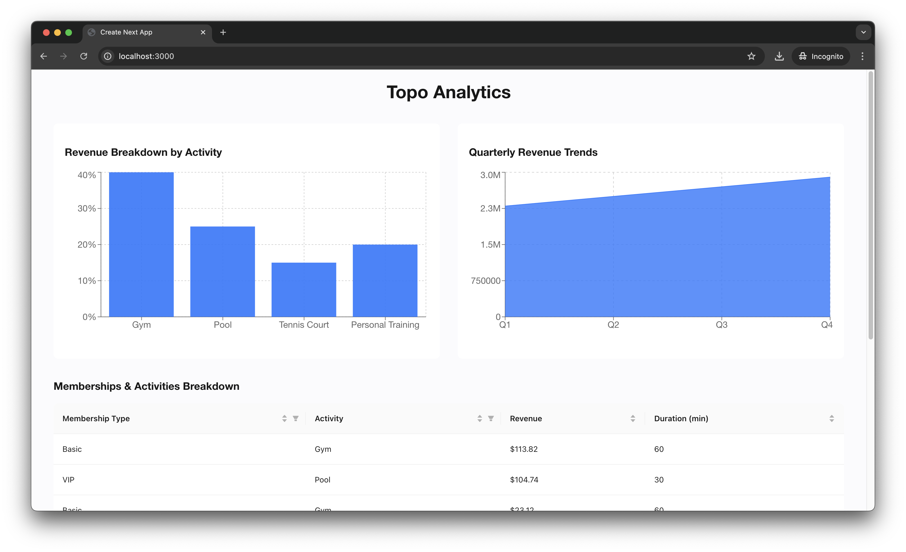

# Project Setup

## Prerequisites

- Python >3.12 with pipenv
- Node.js >=18

## Setting up the Django Backend

```bash
git clone git@github.com:sdivakarrajesh/topo.git
cd topo
pipenv shell # activates the virtual environment
pipenv install # installs the dependencies from the Pipfile
python manage.py migrate # create the tables
python manage.py boostrap_data # imports all the data from the data files into DB tables
# there is also a loaded_db.sqlite3 that has all the data loaded
pipenv run server # start the Django server on port 8484
```

You can create a superuser using the following command

```bash
python manage.py createsuperuser
```

Navigate to `localhost:8484/admin` where the django admin is running. You should see a comprehensive admin page for each of the models(tables) with options to filter and search



## Setting up the Next.js Frontend

```bash
cd topo_client
npm install
npm run dev
```

Now navigate to `localhost:3000` to see the webapp running. You should see something like this:


## Testing

### Running Backend Tests

To run the Django backend tests, use the following command:

```bash
cd topo
pipenv run test
```

### Running Frontend Tests

To run the Next.js frontend tests, use the following command:

```bash
cd topo_client
npm test
```

### Test Descriptions

- **Backend Tests**: This tests if both the APIs return all the required keys
- **Frontend Tests**: Located in the `topo_client/tests` directory. These tests include snapshot tests and unit tests for the React components.


### Assumptions and Challenges

Although the CSV, JSON and PDF data had some structured data, the PPTX file had unstructured. Hardcoded parsing is done in that case